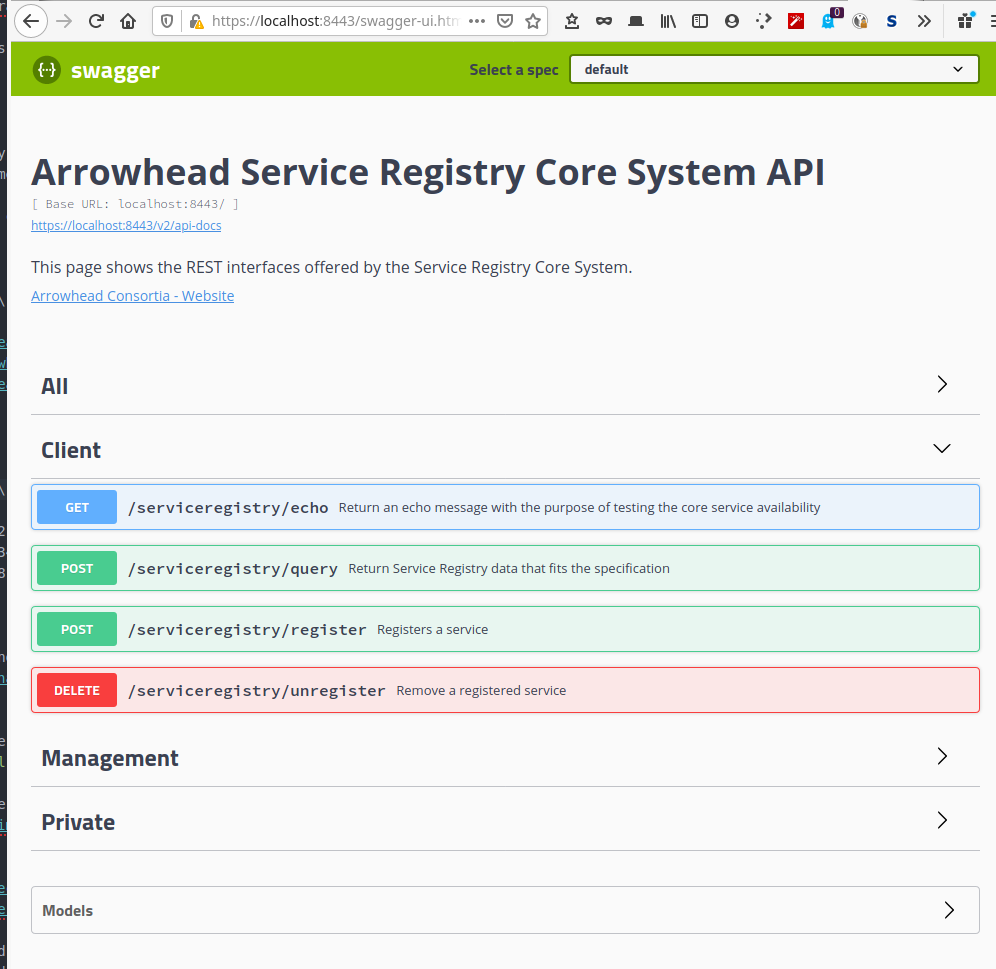
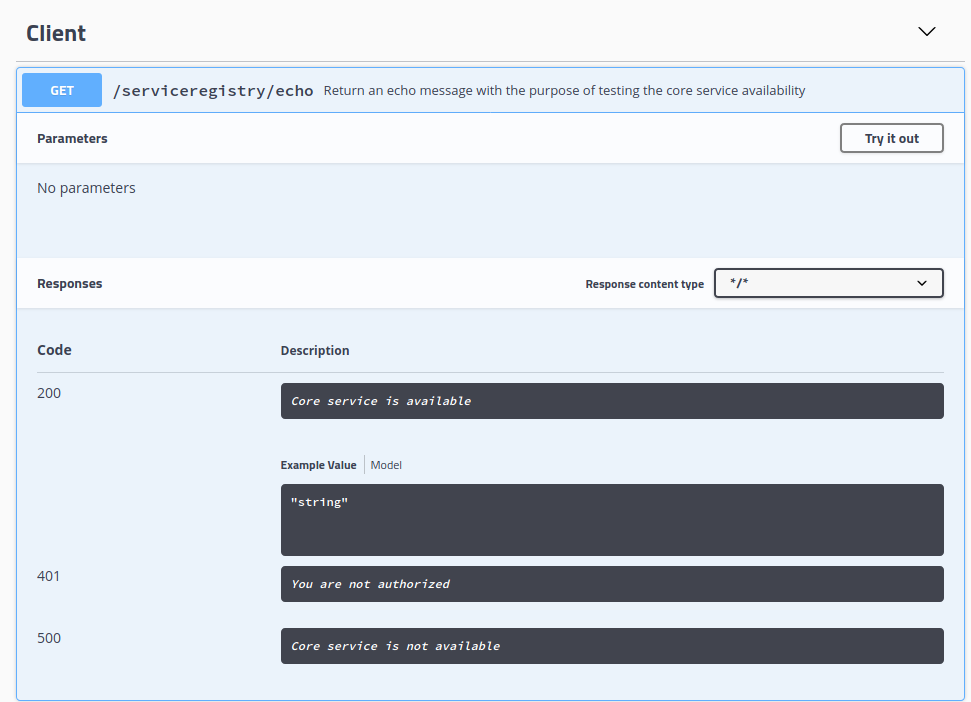
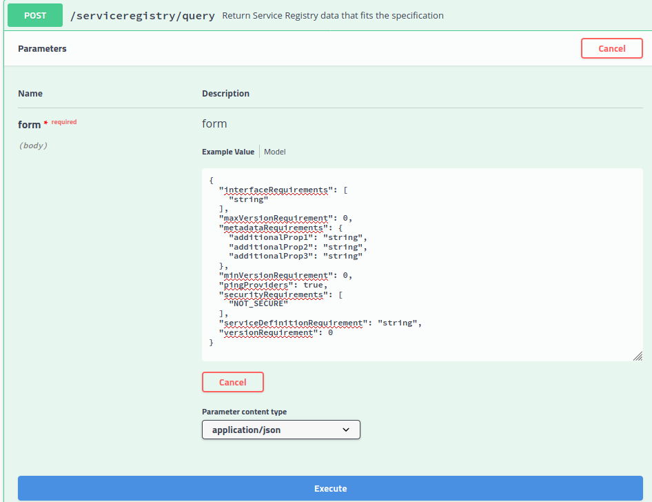
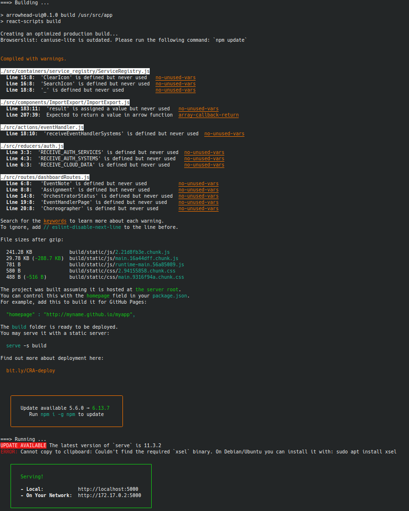
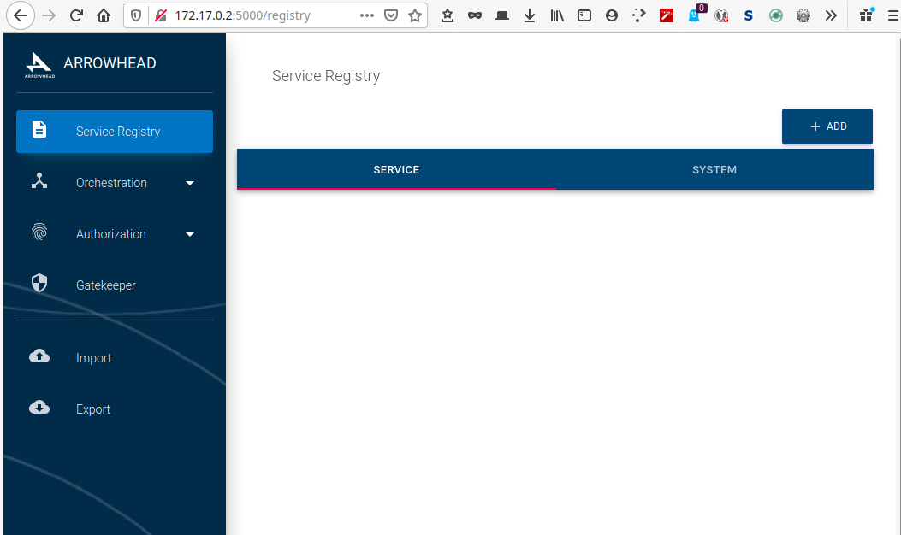
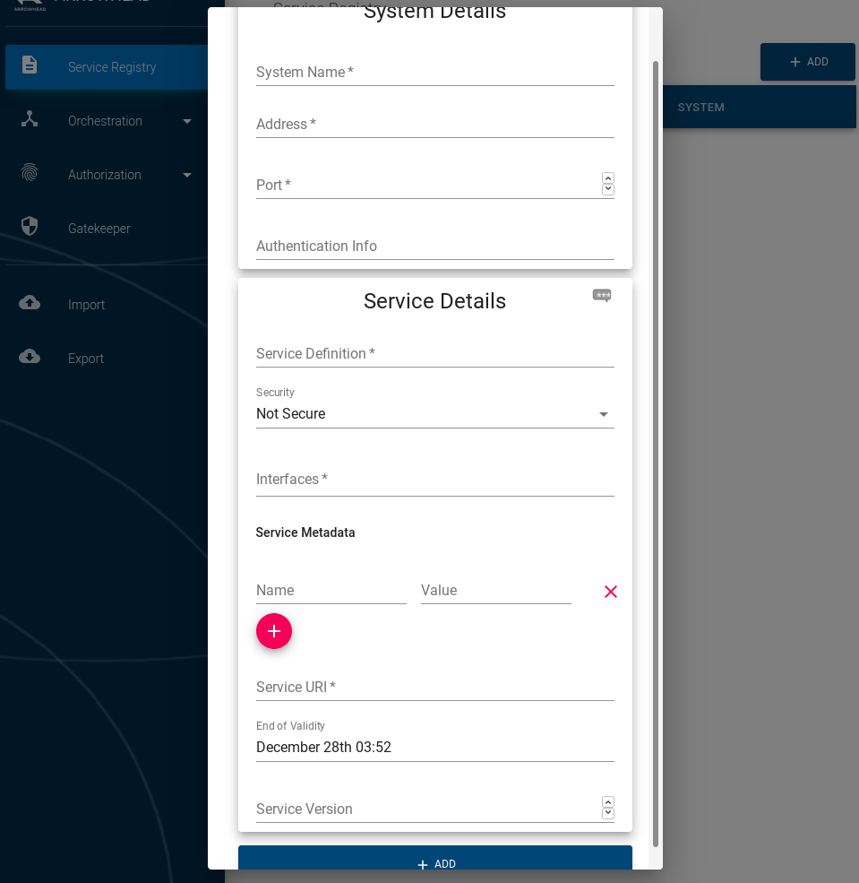

# Installation and configuration

## AH local cloud

1. Download all necessary files if you don want to pull whole repository
```bash
# download all files
wget -c  https://github.com/arrowhead-f/core-java-spring-installers/raw/master/packages/arrowhead-core-common_4.1.3.deb
wget -c  https://github.com/arrowhead-f/core-java-spring-installers/raw/master/packages/arrowhead-authorization_4.1.3.deb
wget -c  https://github.com/arrowhead-f/core-java-spring-installers/raw/master/packages/arrowhead-choreographer_4.1.3.deb
wget -c  https://github.com/arrowhead-f/core-java-spring-installers/raw/master/packages/arrowhead-eventhandler_4.1.3.deb
wget -c  https://github.com/arrowhead-f/core-java-spring-installers/raw/master/packages/arrowhead-gatekeeper_4.1.3.deb
wget -c  https://github.com/arrowhead-f/core-java-spring-installers/raw/master/packages/arrowhead-gateway_4.1.3.deb
wget -c  https://github.com/arrowhead-f/core-java-spring-installers/raw/master/packages/arrowhead-orchestrator_4.1.3.deb
wget -c  https://github.com/arrowhead-f/core-java-spring-installers/raw/master/packages/arrowhead-serviceregistry_4.1.3.deb
```

Passwords chosen in the next/installation step are stored in `/var/cache/debconf/passwords.dat`
so if you forget any you can find them there.
My recommendation is to use same the password everywhere in development environment or at least as long you are not comfortable with the system.
That will probably save you some pulled or/and gray hair.

__Edit 1:__ This caused me a lot of problems. I was trying to unlock certificate-files under the /etc/arrowhead folders that are own by root running KeyStore Explorer as ordinary user. That was really frustrating and I've spent a lot of times troubleshooting it.
So most of the password troubles mentioned above have file-permission origin.
Either runt KeyStore Explorer as root or copy certificate you need to work with and change permissions.

According to the instruction it is mandatory to currently use the following naming convention __my_cloud__.__my_company__.arrowhead.eu

When I looked on the ssl-certificate in my webbrowser I could see this certificate chain:

1. __arrowhead.eu__  
2. __mqtt_cloud.nesko.arrowhead.eu__  
3. __service_registry.mqtt_cloud.nesko.arrowhead.eu__

where __nesko__ is my alias and __mqtt_cloud__ is the name I've chosen for my local cloud.
I'm not really sure what was the question where I answered with "nesko".
Edit: After re-installation I figured out that the question is that you either should enter your name or organization.
In new installation I've chosen ltu (Luleå Tekniska Universitet) to have it more consistent.

```bash
# assuming that files are downloaded in ~/Downloads
sudo apt install ~/Downloads/arrowhead-*.deb

```

### Removing AH cloud

If you by any reason need to remove/reinstall AH cloud use the following command  
`sudo apt purge arrowhead-core-common`

I've so far done reinstallation 2 times and I'm just doing it for the third time.  
This time I'll be using same password for every part of the system (and make it simple for troubleshooting).

### Location of the system settings

After installation all important system settings for the installation are stored in __application.properties__-files.
Those settings can be found here:
```
/etc/arrowhead/systems/authorization/application.properties
/etc/arrowhead/systems/choreographer/application.properties
/etc/arrowhead/systems/event_handler/application.properties
/etc/arrowhead/systems/gatekeeper/application.properties
/etc/arrowhead/systems/gateway/application.properties
/etc/arrowhead/systems/orchestrator/application.properties
/etc/arrowhead/systems/service_registry/application.properties

# the following "files" are just symbolic links to the files above
/usr/share/arrowhead/authorization/application.properties
/usr/share/arrowhead/choreographer/application.properties
/usr/share/arrowhead/event_handler/application.properties
/usr/share/arrowhead/gatekeeper/application.properties
/usr/share/arrowhead/gateway/application.properties
/usr/share/arrowhead/orchestrator/application.properties
/usr/share/arrowhead/service_registry/application.properties
```

Example file: __service_registry/application.properties__  
```properties
############################################
###       APPLICATION PARAMETERS         ###
############################################

# Database connection (mandatory)
# Change the server timezone if neccessary
spring.datasource.url=jdbc:mysql://127.0.0.1:3306/arrowhead?serverTimezone=Europe/Budapest
spring.datasource.username=service_registry
spring.datasource.password=<mariadb/mysqldb password>
spring.datasource.driver-class-name=com.mysql.cj.jdbc.Driver

spring.jpa.database-platform=org.hibernate.dialect.MySQL5InnoDBDialect
# use true only for debugging
spring.jpa.show-sql=false  
spring.jpa.properties.hibernate.format_sql=true
spring.jpa.hibernate.ddl-auto=none

# Service Registry web-server parameters
server.address=0.0.0.0
server.port=8443
domain.name=192.168.1.80 # this is my hosts IP-address on local network
domain.port=8443

############################################
###       CUSTOM PARAMETERS              ###
############################################

# Name of the core system
core_system_name=SERVICE_REGISTRY

# Show all request/response in debug log
log_all_request_and_response=false

# Service Registry has an optional feature to ping service providers in a fixed time interval,
# and remove service offerings where the service provider was not available
# use this feature (true/false)
ping_scheduled=false
# how much time the Service Registry should wait for the ping response (in milliseconds)
ping_timeout=5000
# how frequently should the ping happen, in minutes
ping_interval=60

# Service Registry has an optional feature to automatically remove service offerings, where the endOfValidity
# timestamp field is in the past, meaning the offering expired
# use this feature (true/false)
ttl_scheduled=false
# how frequently the database should be checked for expired services, in minutes
ttl_interval=10

# Interface names has to follow this format <PROTOCOL>-<SECURITY>-<FORMAT>, where security can be SECURE or INSECURE and protocol and format must be a sequence of letters, numbers and underscore.
# A regexp checker will verify that. If this setting is set to true then the PROTOCOL and FORMAT must come from a predefined set.
use_strict_service_intf_name_verifier=false

############################################
###           SECURE MODE                ###
############################################

# configure secure mode

# Set this to false to disable https mode
server.ssl.enabled=true

server.ssl.key-store-type=PKCS12
server.ssl.key-store=file:/etc/arrowhead/systems/service_registry/service_registry.p12
server.ssl.key-store-password=<chosen core-common password>
server.ssl.key-alias=service_registry
server.ssl.key-password=<chosen core-common password>
server.ssl.client-auth=need
server.ssl.trust-store-type=PKCS12
server.ssl.trust-store=file:/etc/arrowhead/truststore.p12
server.ssl.trust-store-password=<chosen core-common password>

#If true, http client does not check whether the hostname is match one of the server's SAN in its certificate
#Just for testing, DO NOT USE this feature in production environment
disable.hostname.verifier=false
```

## Certificates

Ignore [instruction](https://github.com/eclipse-arrowhead/core-java-spring/blob/master/documentation/certificates/import_sysop_certificate_linux.pdf) about importing test certificate in browser because that certificate is already expired.

After installing AH local cloud you can find __master.p12__-file at:  
`/etc/arrowhead/master.p12`

I've also used [scripts](https://github.com/eclipse-arrowhead/core-java-spring/tree/master/scripts/certificate_generation) to generate all certificates which are by default saved in the folder __..\__ = on level up.

## Docker

```bash
sudo apt update
sudo apt upgrade
sudo apt-get install apt-transport-https ca-certificates curl gnupg-agent software-properties-common

cd ~/Downloads

curl -fsSL https://download.docker.com/linux/ubuntu/gpg | sudo apt-key add -
sudo apt-key fingerprint 0EBFCD88
sudo add-apt-repository    "deb [arch=amd64] https://download.docker.com/linux/ubuntu \
   $(lsb_release -cs) \
   stable"
sudo apt update

sudo apt-get install docker-ce docker-ce-cli containerd.io
```

### Docker Compose

```bash
sudo curl -L "https://github.com/docker/compose/releases/download/1.27.4/docker-compose-$(uname -s)-$(uname -m)" -o /usr/local/bin/docker-compose
sudo chmod +x /usr/local/bin/docker-compose

sudo curl -L https://raw.githubusercontent.com/docker/compose/1.27.4/contrib/completion/bash/docker-compose -o /etc/bash_completion.d/docker-compose
```

- bash completion
    `sudo curl -L https://raw.githubusercontent.com/docker/compose/1.27.4/contrib/completion/bash/docker-compose -o /etc/bash_completion.d/docker-compose`

## [Arrowhead Managemnt Tool](https://github.com/arrowhead-tools/mgmt-tool-js)

### Swagger

You've probably already heard about famous Swagger
and if you even wandered, as I did, what the hack Swagger is and how does it look like I'll do you a favor and post a few screen shoots here:


__Main page__


__Client GET__


__Client POST execute command__

No, it wasn't really what you expected isn't it :)
So you can do pretty much everything with the Swagger interface.
You don't actually need Management Tool.
You usually use json format for Swagger.
I haven't worked with either yet but Management Tool has an "field based" interface where you choose what you want to do and fill in the form.
You'll soon see what I mean.

### Managemnt Tool

This tool is providing a user interface to manage Arrowhead core systems. Currently the following core systems are supported:
1. ServiceRegistry (SQL version)
2. Authorization System (both intra- and inter-cloud authorization schemas)
3. Orchestration Store
4. Gatekeeper and Gateway settings
5. Event Handler

__Installation as docker image__

First pull the image from registry  
'sudo docker pull svetlint/management-tool`

... then run it with `docker run` command

example:
```bash
sudo docker run -it -p 3000:5000 \
--name management-tool \
-e ARROWHEAD_SR_URL=http://arrowhead.tmit.bme.hu:8342 \
-e ARROWHEAD_ORCH_URL=http://arrowhead.tmit.bme.hu:8340 \
-e ARROWHEAD_GK_URL=http://arrowhead.tmit.bme.hu:8348 \
svetlint/management-tool
```
... or on local host:  
```bash
sudo docker run -it -p 3000:5000 \
--name management-tool \
-e ARROWHEAD_SR_URL=localhost:8342 \
-e ARROWHEAD_ORCH_URL=localhost:8340 \
-e ARROWHEAD_GK_URL=localhost:8348 \
svetlint/management-tool
```

After installing/building something similar to this will be shown:


After installation docker container can be started with this command:  
`sudo docker start management-tool`

Web interface on host is available as: `http://172.17.0.2:5000`  

__Start page__

Do you remember what I said about filling the form?
This is what I mean by that:

__Add service form__

So you can use either Swagger or Management Tool and both have its advantages and disadvantages.

## [ActiveMQ](https://github.com/eclipse-arrowhead/core-java-spring/blob/master/documentation/gatekeeper/GatekeeperSetup.md)

Arrowhead Gatekeeper and Arrowhead Gateway are two optional core systems that allow consumers in the local cloud to use providers from other clouds. Because local clouds often can't be accessed from outside, the gatekeeper and gateway systems use a third party software (ActiveMQ) as relay to make connection between clouds.

ActiveMQ supports the MQTT protocol and will automatically map between JMS/NMS and MQTT clients. MQTT is a machine-to-machine (M2M) publish/subscribe messaging transport.

### ActiveMQ: Installation

```bash
cd /tmp/
# assuming 5.16.0 is the latest ActiveMQ version
wget http://archive.apache.org/dist/activemq/5.16.0/apache-activemq-5.16.0-bin.tar.gz
tar xvzf /tmp/apache-activemq*.tar.gz -C /tmp
rm /opt/apache-activemq-5.16.0-bin.tar.gz
sudo mv /tmp/apache-activemq* /opt/
sudo chown -R root:root /opt/apache-activemq*
```

## Eclipse-Mosquitto

### Install and Configure

Mosquitto is going to be installed on Raspberry Pi 3

1. Install docker if not already installed  
    [Difference between up, run and start](https://docs.docker.com/compose/faq/#whats-the-difference-between-up-run-and-start)

    Typically, you want docker-compose up. Use up to start or restart all the services defined in a docker-compose.yml. In the default “attached” mode, you see all the logs from all the containers. In “detached” mode (-d), Compose exits after starting the containers, but the containers continue to run in the background.

    Use `docker-compose up` to start or restart all the services defined in a __docker-compose.yml__. In the default “attached” mode, you see all the logs from all the containers. In “detached” mode (__-d__), Compose exits after starting the containers, but the containers continue to run in the background.

    The `docker-compose run` command is for running “one-off” or “adhoc” tasks. It requires the service name you want to run and only starts containers for services that the running service depends on. Use run to run tests or perform an administrative task such as removing or adding data to a data volume container. The run command acts like docker run __-ti__ in that it opens an interactive terminal to the container and returns an exit status matching the exit status of the process in the container.

    Basicaly use `docker-compose run` to execute commands against a running service, and `docker-compose up` to spawn a new service
2. Pull mosquitto docker image see [Docker official images](https://registry.hub.docker.com/_/eclipse-mosquitto)
    `docker pull eclipse-mosquitto`
3. Run
    - interactivly
    `docker run -it -p 1883:1883 -p 9001:9001  eclipse-mosquitto`
    - as deamon
    `docker run -d -p 1883:1883 -p 9001:9001  eclipse-mosquitto`

### Configure firewall (ufw)

Add following rules
```bash
# client port: 1883 (defautl MQTT port)
sudo ufw allow from 192.168.1.0/24 to any port 1883

# client TLS port: 8883 (default port for MQTT over TLS)
sudo ufw allow from 192.168.1.0/24 to any port 8883

# admin port: 9001
sudo ufw allow from 192.168.1.0/24 to any port 9001
```
