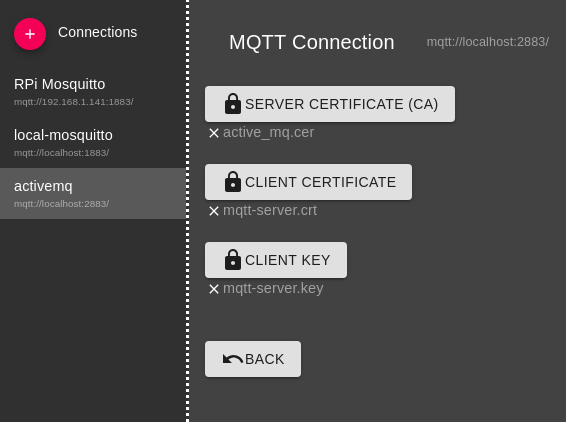

# Generating self-signed certificate for Eclipse Mosquitto

- **.key**-files are private keys
- **\*-ca.key**-file is root key used to sign certificate request (crt) files
- **.crt**-files are public keys (x509)
- **.csr**-files are certify request files that are going to be signed by privite keys
- **trust-store.p12**-files are used for storing all trusted sources' public keys, for instance to be able to connect to mqtt-broker that use p12-format like ActiveMQ you need to add you public key (crt) in the brokers trust store.
Client trying to connect needs its own public and private key as well as brokers public key.  
For mgtt-explorer for connecting to ActiveMQ, settings are:  
  

## Server

```bash
openssl genrsa -des3 -out mosquitto-ca.key 2048

openssl req -new -x509 -days 3650 -key mosquitto-ca.key -out mosquitto-ca.crt
# Enter pass phrase for mosquitto-ca.key:
# Country Name (2 letter code) [AU]:SE
# State or Province Name (full name) [Some-State]:Stockholm
# Locality Name (eg, city) []:Stockholm
# Organization Name (eg, company) [Internet Widgits Pty Ltd]:CAmaster
# Organizational Unit Name (eg, section) []:umu
# Common Name (e.g. server FQDN or YOUR name) []:mqtt
# Email Address []:email@mail.com

openssl genrsa -out mqtt-server.key 2048
```

```bash
openssl req -new -out mqtt-server.csr -key mqtt-server.key

# Country Name (2 letter code) [AU]:SE
# State or Province Name (full name) [Some-State]:Stockholm
# Locality Name (eg, city) []:Stockholm
# Organization Name (eg, company) [Internet Widgits Pty Ltd]:Server-cert
# Organizational Unit Name (eg, section) []:umu
# Common Name (e.g. server FQDN or YOUR name) []:127.0.0.1
# Email Address []:email@mail.com

# Please enter the following 'extra' attributes to be sent with your certificate request
# A challenge password []:
# An optional company name []:
```

```bash
openssl x509 -req -in mqtt-server.csr -CA mosquitto-ca.crt -CAkey mosquitto-ca.key -CAcreateserial -out mqtt-server.crt -days 3650
# Signature ok
# subject=C = SE, ST = Stockholm, L = Stockholm, O = Server-cert, OU = umu, CN = 127.0.0.1, emailAddress = email@mail.com
# Getting CA Private Key
# Enter pass phrase for mosquitto-ca.key:
```

## Client

```bash
openssl genrsa -des3 -out mqtt-client.key 2048
# Enter pass phrase for ../client/mqtt-client.key:
# Country Name (2 letter code) [AU]:SE
# State or Province Name (full name) [Some-State]:Stockholm
# Locality Name (eg, city) []:Stockholm
# Organization Name (eg, company) [Internet Widgits Pty Ltd]:Client-cert
# Organizational Unit Name (eg, section) []:umu
# Common Name (e.g. server FQDN or YOUR name) []:fipy
# Email Address []:cnesko@e.email
openssl req -out mqtt-client.csr -key mqtt-client.key -new
openssl x509 -req -in mqtt-client.csr -CA mosquitto-ca.crt -CAkey mosquitto-ca.key -CAcreateserial -out mqtt-client.crt -days 3650
```
